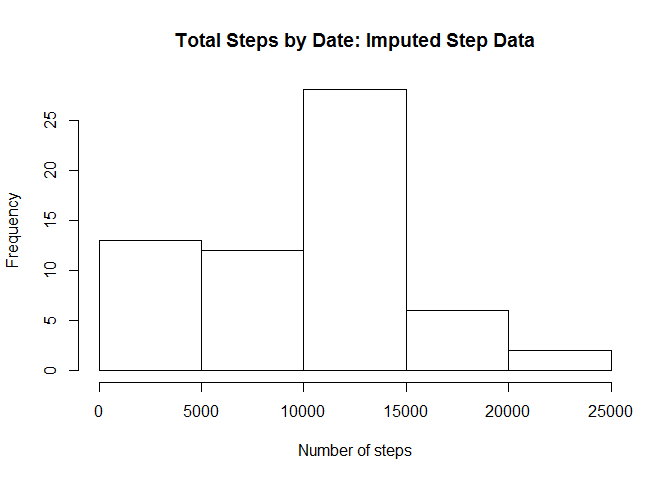

# Reproducible Research: Peer Assessment 1


## Loading and preprocessing the data


```r
# First set working directory to location of "activity.csv"

# Load data
stepdata <- read.csv("activity.csv",header=TRUE)
```

## What is mean total number of steps taken per day?
Total number of steps per day


```r
library(dplyr)
```

```
## 
## Attaching package: 'dplyr'
```

```
## The following objects are masked from 'package:stats':
## 
##     filter, lag
```

```
## The following objects are masked from 'package:base':
## 
##     intersect, setdiff, setequal, union
```

```r
groupbydate <- group_by(stepdata,date)
total.steps.per.day <- dplyr::summarise(groupbydate,sum(steps,na.rm=TRUE))
```
Histogram for total steps per day


```r
hist(total.steps.per.day[[2]], main="Histogram: Total Number of Steps per Day",
        xlab="Number of steps")
```

<!-- -->

Mean and Median total number of steps per day


```r
mean.steps.per.day <- mean(total.steps.per.day[[2]],na.rm=TRUE)
median.steps.per.day <- median(total.steps.per.day[[2]],na.rm=TRUE)
results <- cbind(mean.steps.per.day,median.steps.per.day)
names(results) <- c("Mean","Median")
```
The mean number of steps per day for the original data is 9354.2295082.  
The median number of steps per day for the original data is 1.0395\times 10^{4}.

## What is the average daily activity pattern?

Create time series plot for total steps by interval


```r
group.by.interval <- group_by(stepdata,interval)
total.steps.by.int <- dplyr::summarise(group.by.interval,sum(steps,na.rm=TRUE))
names(total.steps.by.int)<-c("interval","total.steps")
with(total.steps.by.int,plot(y=total.steps,x=interval,type="l",
	main="Time Series Plot: Total Steps per interval"))
```

<!-- -->

Interval with maximum number of total steps


```r
max.interval <- which(total.steps.by.int[[2]]==max(total.steps.by.int$total.steps))
interval <- total.steps.by.int[max.interval,][[1]]
max.step <- total.steps.by.int[max.interval,][[2]]
```

The maximum total steps is 10927 and occurs at interval 835.

## Imputing missing values

Count number of rows containing a missing value.


```r
total.missing <- sum(apply(stepdata, 1, function(x){any(is.na(x))}))
```

There are 2304 missing values.

Create new data set with imputed values for missing values


```r
# Get median for each interval and merge with original data set
med.step.by.int <- dplyr::summarise(group.by.interval,median(steps,na.rm=TRUE))
names(med.step.by.int) <- c("interval","median")
mergedStepData <- merge(stepdata,med.step.by.int)

# Copy merged data set into new data set that will contain the imputed values
imputeStepData <- mergedStepData

# Replace na values with the median for corresponding interval
na.steps <- is.na(imputeStepData$steps)
imputeStepData$steps[na.steps] <- imputeStepData$median[na.steps]

# Only want the variables relating to original data set
imputeStepData <- select(imputeStepData,steps,date,interval)
```

Make Histogram of total steps per day using imputed data set


```r
impute.by.date <- group_by(imputeStepData,date)
impute.total.steps.by.date <- summarise(impute.by.date,sum(steps,na.rm=TRUE))
hist(impute.total.steps.by.date[[2]],main="Total Steps by Date: Imputed Step Data",
     xlab="Number of steps")
```

<!-- -->

Mean and Median total number of steps per day for imputed data set


```r
imp.mean.steps.per.day <- mean(impute.total.steps.by.date[[2]],na.rm=TRUE)
imp.median.steps.per.day <- median(impute.total.steps.by.date[[2]],na.rm=TRUE)
imp.results <- cbind(round(imp.mean.steps.per.day), round(imp.median.steps.per.day))
names(imp.results) <- c("Mean","Median")
```

The mean number of steps per day for the imputed data is 9504.  
The median number of steps per day for the imputed data is 1.0395\times 10^{4}.


```r
rbind(round(results,1),round(imp.results,1))
```

```
##      mean.steps.per.day median.steps.per.day
## [1,]             9354.2                10395
## [2,]             9504.0                10395
```

The imputed data causes the mean to be lowered, but the median is  
not effected by the imputation of missing data.  

## Are there differences in activity patterns between weekdays and weekends?


```r
# Create new column identifying if day is weekend or weekday
daytype <- weekdays(as.Date(imputeStepData$date))
daytype[daytype=="Saturday" | daytype=="Sunday"] <- "weekend"
daytype[!(daytype=="weekend")] <- "weekday"
imputeStepData$daytype <- daytype
```


```r
# Create timeseries plot for mean steps per interval by weekend
library(lattice)
group.daytype.int <- group_by(imputeStepData, interval, daytype)
mean.steps.daytype.int <- summarize(group.daytype.int,mean(steps,na.rm=TRUE))
names(mean.steps.daytype.int) <- c("interval","daytype","steps")
xyplot(data=mean.steps.daytype.int, steps ~ interval | daytype, t="l",
       layout=c(1,2),main="Mean Steps per Interval")
```

<!-- -->
